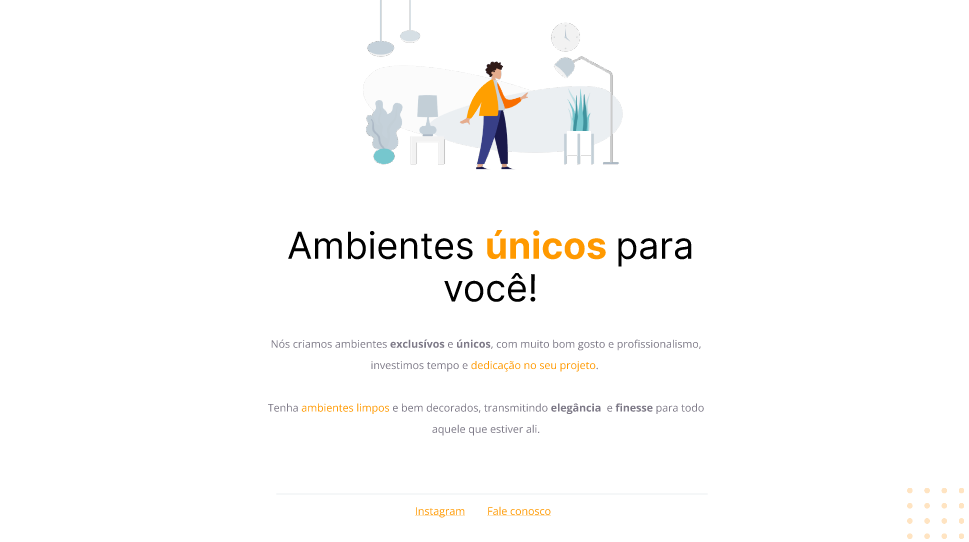

<h1 align="center"> Stage 02 - EXPLORER </h1>

Desafio desenvolvido durante as aulas do módulo 1 do Stage 02 do curso Explorer 

  <a href="#-tecnologias">Tecnologias</a>&nbsp;&nbsp;&nbsp;|&nbsp;&nbsp;&nbsp;
  <a href="#-projeto">Projeto</a>&nbsp;&nbsp;&nbsp;|&nbsp;&nbsp;&nbsp;
  <a href="#-layout">Layout</a>&nbsp;&nbsp;&nbsp;|&nbsp;&nbsp;&nbsp;
 

 

  

## 🚀 Tecnologias

Esse projeto foi desenvolvido com as seguintes tecnologias:

- HTML e CSS
- Figma

## 🔖 Layout

Você pode visualizar o layout do projeto através [desse link](https://www.figma.com/file/2zxndTU7bXykQQUWRIbhH7/Explorer---Projeto-01-(Copy)?type=design&t=4MQ9BwGSW9fxFIdH-6).
É necessário ter uma conta no [Figma](https://www.figma.com) 

## Licença

Esse projeto está sob a licença MIT.

 
